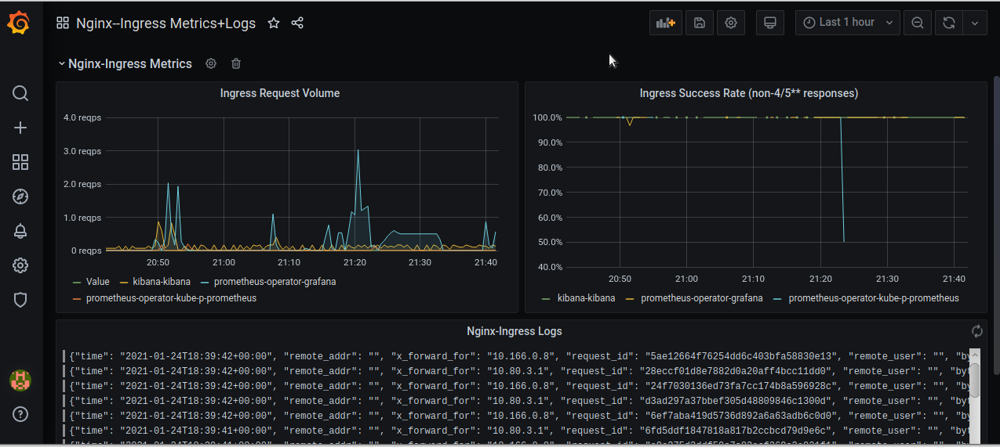

# brdm88_platform
brdm88 Platform repository

Kubernetes-Logging
==================

##### Базовая часть

В рамках данного задания выполнено следующее:
 - В GKE развернут кластер 4-мя нодами в 2-х пулах. Развернуто приложение *Hipster Shop*.

 - В кластере, на нодах из пула infra-pool, развернут EFK-стек посредством Helm. 

 - Развернут *nginx-ingress* (3 реплики на нодах infra-pool) для возможности доступа к Kibana.

 - Развернут *Elasticsearch Exporter* для мониторинга ES (предварительно развернут *Prometheus Operator* из чарта).

 - Проведен эксперимент с выводом из работы нод Elasticsearch. Добавлен dashboard для Elasticsearch (#4358) в Grafana.

 - Для *nginx-ingress* активирован экспорт метрик через соответствующее определение в values.yaml. Добавлен фильтр для преобразования формата логов Nginx в JSON. Добавлен dashboard для nginx-ingress (#9614) в Grafana.

 - В Kibana cоздан Dashboard для визуализации следующих метрик nginx-ingress: общее количество запросов к nginx-ingress, кол-во запросов с различными статусами. Конфигурация выгружена в файл export.ndjson.

 - В кластере развернуты Loki и Promtail, используя Helm. Datasource Loki добавлен в values.yaml для Prometheus Operator.
 
 - Создан dashboard в Grafana, агрегирующий метрики nginx-ingress, а также его логи.

Ниже приложены скриншоты dashboard-ов в *Grafana* и *Kibana*, отражающих некоторые метрики и логи *Nginx-Ingress*.

###### Kibana Dashboard

###### Grafana Dashboard

----
----

Kubernetes-Monitoring
=====================

##### Базовая часть

В рамках данного задания выполнено следующее:

 - Развернут кластер GKE в Google Cloud с нодами *g1-small*, в кластер перед началом основных работ установлены *Nginx-ingress* и *Cert-Manager* для возможности работы по HTTPS. 

 - В кластер установлен *Prometheus Operator* из чарта с помощью Helm 3. Настроены Ingress-ы для сервисов подсистемы мониторинга.

 - Создан Docker-образ на базе Nginx, отдающий `stub_status`, развернут *Deployment* с тремя репликами (nginx-exporter встроен в поды в качестве sidecar-контейнера). Созданы манифесты для *Service* и *ServiceMonitor*

 - В Grafana развернут Dashboard “Nginx Exporter”.

Манифесты деплоя тестового workload, а также все необходимое для сборки docker-образа, находится в подпапке **nginx-custom**.

Ниже приложены скриншоты страницы target-ов в Prometheus, а также дашборда в Grafana во время запущенного через siege нагрузочного теста сервиса на базе Nginx.

###### Prometheus Targets

###### Grafana Dashboard

----
----

Kubernetes-Operators
====================

##### Базовая часть

В рамках данного задания выполнено следующее:
 - Развернут кластер в Minikube, созданы манифесты кастомного ресурса для использования MySQL-оператором.
 - Задание выполнялось на версии Kubernetes 1.20, в силу чего структура манифеста CRD была изменена относительно предложенного в задании варианта для возможности работы в `apiVersion: apiextensions.k8s.io/v1`. Добавлены определения обязательности полей.

 - Реализован контроллер на Python для работы оператора. Для проверки работоспособности развернута БД, затем CR был удален и пересоздан - восстановление БД из бэкапа отработало (только в случае с Minikube PV пришлось удалить вручную).
 - Собран Docker-образ с контроллером, и загружен на Docker Hub. Далее, оператор развернут в кластере, после чего проверена работоспособность процессов создания и удаления CR.

----
----

Kubernetes-Templating
=====================

##### Базовая часть

В рамках данного задания выполнено слудующее:
 - С помощью *Terraform* развернут кластер GKE в Google Cloud (файлы конфигурации находятся в подпапке `terraform-gke`)
 - С помощью *Helm 3* установлены Helm-чарты для *nginx-ingress*, *cert-manager*, *chartmuseum*, *harbor*.
 - Для того, чтобы работал *cert-manager*, необходимо дополнительно создать объект `ClusterIssuer`
 - Сконфигурирован Ingress для ChartMuseum. Проведена проверка успешности установки ChartMuseum. Работа с ChartMuseum производится посредством HTTP-запросов.
 - Установлен Harbor и сконфигурирован Ingress для него, проведена проверка успешности установки.

Команды установки чартов находятся в папке `scripts`.

 - Создан чарт для приложения *Hipster Shop*, после чего последнее развернуто в кластере (для проверки доступа через NodePort сервис был открыт соответствующий порт на файерволе GCP). 
Далее, отдельно выделен чарт для компонента *frontend* и добавлен как зависимость к чарту Hipster Shop. Создан манифест для Ingress. Для данного чарта шаблонизированы следующие параметры: число реплик деплоя, тэг образа, порты и тип сервиса. Чарты загружены в установленный экземпляр Harbor (с включенным Chartmuseum).

 - Для компонентов Paymentservice и Shippingservice изучена и произведена установка в кластер с помощью Kubecfg.

----
----

Kubernetes-Volumes
===================

##### Базовая часть

В рамках данного задания развернут локальный кластер Kind, в котором запущен MinIO (StatefulSet и Headless Service). Изучена работа MinIO. Для возможности доступа к MinIO Browser из-за пределов кластера дополнительно создается Ingress.

##### Дополнительные задания

Манифест MinIO StatefulSet доработан для передачи значений переменных окружения через секрет Kubernetes. Объект *Secret* создается с помощью команды `kubectl create secret generic minio-secret --from-literal=MINIO_ACCESS_KEY=minio --from-literal=MINIO_SECRET_KEY=minio123 -o yaml > minio-secret.yaml`.

----
----

Kubernetes-Networks
===================

##### Базовая часть

1) В рамках данного задания реализованы манифесты Deployment с probes и Service для макетного pod-a из первой работы. Изучена работа ClusterIP. На локальном кластере Minikube включен режим балансировки IPVS, перезапущен kube-proxy и очищены неиспользуемые правила iptables. На ноде minikube установлены ipvsadm и ipset, исследована работа IPVS.

2) В локальном кластере развернут MetalLB. Развернут Service типа LoadBalancer.

3) В локальном кластере развернут Ingress-контроллер на базе Nginx. Запущен headless service для макетного веб-сервиса и правило Ingress для доступа к нему.

##### Дополнительные задания

* Реализован манифест для сервиса (точнее, двух, для TCP и UDP) типа LoadBalancer для доступа к CoreDNS из-за пределов кластера.

* Организован доступ к Kubernetes Dashboard (был установлен из отдельного репозитория, а не как аддон Minikube) через nginx-ingress. Для того, чтобы доступ был возможен по URL *https://<ip_of_nginx_ingress>/dashboard* (без '/' в конце), пришлось добавить в конфигурацию дополнительные правила `rewrite` чере аннотацию `nginx.ingress.kubernetes.io/configuration-snippet` в манифесте *Ingress*. Для возможности полноценного использования Dashboard добавляется *ServiceAccount* с ролью *cluster-admin* в namespace *kubernetes-dashboard*.

* Реализованы 2 набора манифестов (*Deployment, Service, Ingress*): для "текущей" версии приложения и для "обновленной", разворачиваемой канареечным деплоем. В манифесте *Ingress* для "канареечной" версии конфигурация производится с помощью аннотаций. Перенаправление запросов производится в зависимости от значения HTTP-заголовка `X-IsCanary`. Доступ к макетному сервису организован по URL *http://ingress.local/canary* (при этом имя *ingress.local* должно разрешаться в IP-адрес Nginx-Ingress). Подобный подход был применен в силу того, что Canary в Nginx-Ingress не работает без указания имени хоста.

----
----

Kubernetes-Security
===================

##### Базовая часть

В рамках данного задания реализованы манифесты для создания аккаунтов (сущность ServiceAccount) и предоставления им определенных прав в кластере (сущности ClusterRole, ClusterRoleBinding, Role, RoleBinding).

----
----

Kubernetes-Controllers
======================

##### Базовая часть

В рамках данного задания предварительно развернут локальный кластер Kind из 3-х master и 3-х worker нод. Изучена работа ReplicaSet на примере сервиса frontend от Hipster Shop. При обновлении ReplicaSet (применении манифеста с новой версией в шаблоне) запущенные поды не обновились, версия образа обновилась только при пересоздании подов. Такая особенность работы ReplicaSet обусловлена тем, что ReplicaSet, как и ReplicationController, не проверяет соответствие запущенных подоб шаблону, а только лишь следит за количеством запущенных подов.
Изучена работа Deployment, механизм обновления Rolling Update и работа Probes.

##### Дополнительные задания

* Реализованы сценарии развертывания **Blue-Green** и **Reverse Rolling Update** для сервиса frontend.
* Реализован манифест **DaemonSet** для развертывания *Node Exporter* на всех нодах кластера (включая master-ноды). Развертывание подов DaemonSet-а на master-нодах обеспечивается указанием в манифесте `tolerations` в шаблоне пода (в контексте данного задания в кластере Kind Taints присутствуют только на master-нодах, поэтому в секции Tolerations достаточно будет обойтись `operator: Exists`).

----
----

Kubernetes-Intro
================

##### Базовая часть

В рамках выполнения данного задания подготовлено локальное окружение для работы с Kubernetes. Развернут локальный кластер с помощью Minikube. Опробовано самовосстановление подов в namespace kube-system после их удаления.

* Поды системных компонент Kubernetes (`kube-apiserver, kube-controller-manager, kube-scheduler, etcd`) являются **static pods** и управляются непосредственно kubelet-ом на ноде, соответственно последний следит за их состоянием и восстанавливает после удаления. Манифесты static pod-ов находятся на ноде по пути `/etc/kubernetes/manifests`

* В свою очередь, поды core-dns и kube-proxy управляются уже механизмами кластера Kubernetes (описаны соответственно как Deployment и DaemonSet в NS kube-system) и восстанавливаются в силу того, что kube-controller-manager следит за состоянием кластера и при любых «непредвиденных» изменениях стремится привести его к состоянию, описанному в etcd.

Написан Dockerfile макетного веб-сервиса и манифест Pod для запуска данного сервиса в кластере, pod запущен в кластере Minikube.

##### Дополнительные задания

В локальном кластере запущен сервис frontend от Hipster Shop. Выяснена и исправлена причина его незапуска. 
В изначальной конфигурации frontend не запускался по причине того, что не были заданы необходимые переменные окружения.
Например, в выводе команды `kubectl logs` для этого пода имеем:  `panic: environment variable "PRODUCT_CATALOG_SERVICE_ADDR" not set`, подобным образом можно выявить и другие недостающие значения переменных. 
В исправленном манифесте *frontend-pod-healthy.yaml*, при применении которого под запускается, заданы значения необходимых переменных.

